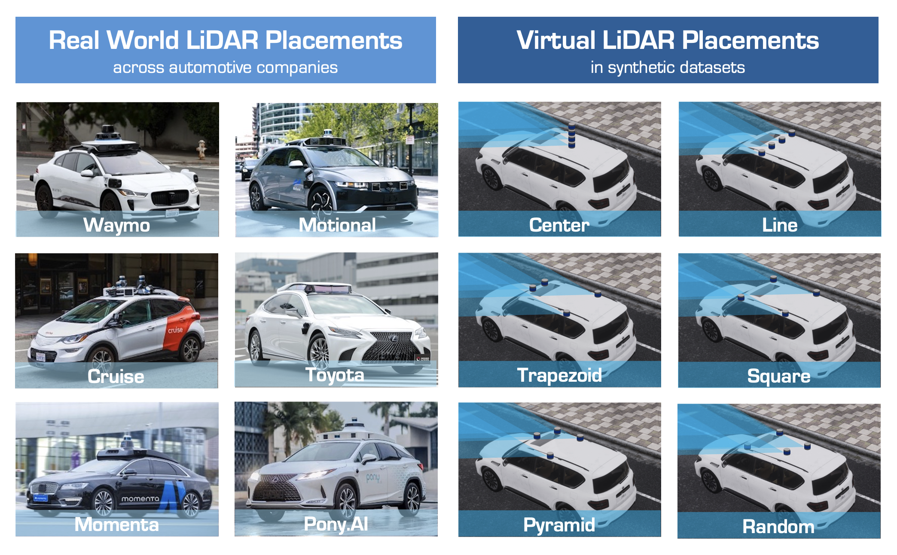

<h1 align="center">🤖 RoboSense Track 3:<br>Sensor Placement</h1>


<div align="center">

**Official Baseline Implementation for [Track 3](https://robosense2025.github.io/track3)**

*Based on Place3D -- "Is Your LiDAR Placement Optimized for 3D Scene Understanding?"*<br>(https://github.com/ywyeli/Place3D)

[](https://robosense2025.github.io/)
[](https://robosense2025.github.io/track3)
[](https://iros2025.org/)
[](https://www.codabench.org/competitions/9284/)
[](LICENSE)

**🏆 Prize Pool: $2,000 USD for Track 3 Winners**

<p align="center">
  
</p>

</div>


## Challenge Overview

**Track 3: Sensor Placement** challenges participants to design LiDAR-based 3D perception models, including those for 3D object detection, that can adapt to diverse sensor placements in autonomous systems.

Participants will be tasked with developing novel algorithms that can adapt to and optimize LiDAR sensor placements, ensuring high-quality 3D scene understanding across a wide range of environmental conditions, such as weather variances, motion disturbances, and sensor failures.

### 🎯 Objectives

To be added.


## Competition Details

- **Venue**: IROS 2025, Hangzhou (Oct 19-25, 2025)
- **Registration**: [Google Form](https://docs.google.com/forms/d/e/1FAIpQLSdwfvk-NHdQh9-REiBLCjHMcyLT-sPCOCzJU-ux5jbcZLTkBg/viewform) (Open until Aug 15)
- **Contact**: robosense2025@gmail.com


### 🏆 **Awards**

| Prize | Award |
|:-|:-|
| 🥇 1st Place | $1000 + Certificate |
| 🥈 2nd Place | $600 + Certificate |
| 🥉 3rd Place | $400 + Certificate |
| 🌟 Innovation Award | Cash Award + Certificate |
| Participation | Certificate |


## 📊 Official Dataset

The track 3 [dataset](https://huggingface.co/datasets/robosense/datasets/tree/main/track3-sensor-placement) is prepared using data and settings from the [Place3D](https://github.com/ywyeli/Place3D) framework.

<p align="center">
  
</p>

### Dataset Statistics (Phase 1)

In Phase 1, we provide a trainval dataset consisting of camera images from six views and LiDAR data from four different placements. You may choose to train your model on one placement and validate it on others, or design methods that leverage all placements to achieve better generalization.

The dataset contains 200 scenes (8,000 frames) in total, split into 125 scenes (5,000 frames) for training and 75 scenes (3,000 frames) for validation.

All LiDAR data from different placements are collected simultaneously, and they share the same metadata and annotation files. You can create symbolic links pointing to the desired data path, in order to conveniently switch between LiDAR placements.

| File name | Description | split |
|:-|:-|:-|
| track3_phase1_lidar_blobs_only_placement_0 | LiDAR data, placement Center | train, val |
| track3_phase1_lidar_blobs_only_placement_1 | LiDAR data, placement Line | train, val |
| track3_phase1_lidar_blobs_only_placement_2 | LiDAR data, placement Trapezoid | train, val |
| track3_phase1_lidar_blobs_only_placement_3 | LiDAR data, placement Pyramid | train, val |
| track3_phase1_camera_blobs_only | Camera images of 6 views | train, val |
| track3_phase1_sensor_file_blobs | LiDAR data of placement Center + Camera images | train, val |
| track3_phase1_metadata | meta data including annotations (gt) | train, val |
| track3_phase1and2_map | maps | - |

### Dataset Statistics (Phase 2)

In Phase 2, we provide a test dataset that includes camera images from six views and LiDAR data from six different placements. All LiDAR data are organized in a single folder, so you do not need to switch paths when running tests.

Please use the Phase 1 trainval dataset to train and validate your model, and then evaluate its performance on the Phase 2 test set. See the following sections for detailed instructions on how to submit your results.

| File name | Description | split |
|:-|:-|:-|
| track3_phase2_lidar_blobs_only_test_part | LiDAR data | test |
| track3_phase2_camera_blobs_only_test_part | Camera images of 6 views | test |
| track3_phase2_sensor_file_blobs_test_part | LiDAR + Camera data | test |
| track3_phase2_metadata | meta data without annotations (gt) | test |
| track3_phase1and2_map | maps | - |


### Baseline Performance (Phase 1)

To be added.


## 🚀 Quick Start

We provide a simple demo to run the baseline model.

### 1. **Preparing conda env**


The code is built with following libraries:

- Python >= 3.8, \<3.9
- OpenMPI = 4.0.4 and mpi4py = 3.0.3 (Needed for torchpack)
- Pillow = 8.4.0 (see [here](https://github.com/mit-han-lab/bevfusion/issues/63))
- [PyTorch](https://github.com/pytorch/pytorch) >= 1.9, \<= 1.10.2
- [tqdm](https://github.com/tqdm/tqdm)
- [torchpack](https://github.com/mit-han-lab/torchpack)
- [mmcv](https://github.com/open-mmlab/mmcv) = 1.4.0
- [mmdetection](http://github.com/open-mmlab/mmdetection) = 2.20.0
- numpy = 1.23

After installing these dependencies, please run this command to install the codebase:

```bash
cd projects/bevfusion
python setup.py develop
```

We also provide a [Dockerfile](projects/bevfusion/docker/Dockerfile) to ease environment setup. To get started with docker, please make sure that `docker` is installed on your machine. After that, please execute the following command to build the docker image:

```bash
cd projects/bevfusion/docker && docker build . -t bevfusion
```

We can then run the docker with the following command:

```bash
docker run --gpus all -it -v `pwd`/../data:/dataset --shm-size 16g bevfusion /bin/bash
```

We recommend the users to run data preparation (instructions are available in the next section) outside the docker if possible. Note that the dataset directory should be an absolute path. Within the docker, please run the following command to clone our repo and install custom CUDA extensions:

```bash
git clone https://github.com/robosense2025/track3 && cd projects/bevfusion
python setup.py develop
```

You can then create a symbolic link `data` to the `/dataset` directory in the docker.

### 2. **Prepare the dataset**

Add `dataset_utils` path to your `PYTHONPATH`. Edit `~/.bashrc` or `~/.zshrc`:

```bash
export PYTHONPATH="$PYTHONPATH:/[YOUR_PARENT_FOLDER]/track3/projects/dataset_utils"
```

Apply the change:
```bash
source ~/.bashrc  # or ~/.zshrc
```

Please download the dataset from [here](https://huggingface.co/datasets/robosense/datasets/tree/main/track3-sensor-placement). Our dataset is in `nuScenes` format, but requires our customized tools.

We typically need to organize the useful data information with a .pkl or .json file in a specific style for organizing annotations.
To prepare these files, run the following command:

```bash
python tools/create_data.py nuscenes --root-path ./data/nuscenes --out-dir ./data/nuscenes --extra-tag nuscenes
```

After data preparation, you will be able to see the following directory structure (as is indicated in mmdetection3d):

```
mmdetection3d
├── mmdet3d
├── tools
├── configs
├── data
│   ├── nuscenes
│   │   ├── maps
│   │   ├── samples
│   │   ├── v1.0-test
|   |   ├── v1.0-trainval
│   │   ├── nuscenes_database
│   │   ├── nuscenes_infos_train.pkl
│   │   ├── nuscenes_infos_val.pkl
│   │   ├── nuscenes_infos_test.pkl
│   │   ├── nuscenes_dbinfos_train.pkl

```

### 3. **Deploy**
To be added.

### Training

For LiDAR detector, please run:

```bash
torchpack dist-run -np 8 python tools/train.py configs/nuscenes/det/transfusion/secfpn/lidar/voxelnet_0p075.yaml
```

### 4. Evaluate the baseline

You will be able to run:

```bash
torchpack dist-run -np 8 python tools/test.py [config file path] pretrained/[checkpoint name].pth --eval [evaluation type]
```

For example:

```bash
torchpack dist-run -np 8 python tools/test.py configs/nuscenes/det/transfusion/secfpn/lidar/voxelnet_0p075.yaml pretrained/track3-baseline.pth --eval bbox
```


## 🎖️ Challenge Participation

### Submission Requirements

For Phase 1 submission, run the following command:

```bash
torchpack dist-run -np 1 python tools/test.py configs/nuscenes/det/transfusion/secfpn/lidar/voxelnet_0p075.yaml pretrained/track3-baseline.pth --eval bbox --eval-options 'jsonfile_prefix=[PATH_TO_YOUR_OUTPUT_DIR]'
```

For example:

```bash
torchpack dist-run -np 1 python tools/test.py configs/nuscenes/det/transfusion/secfpn/lidar/voxelnet_0p075.yaml pretrained/track3-baseline.pth --eval bbox --eval-options 'jsonfile_prefix=./results'
```

After running, you will find a file named `results_nusc.json` in `./results`. Zip this file and submit `results_nusc.zip` to Codabench. Codabench.

For Phase 2 submission, in `/track3/projects/bevfusionconfigs/nuscenes/default.yaml`, 

1. update line `289` to `ann_file: ${dataset_root + "nuscenes_infos_test.pkl"}`.

2. Comment out lines `207-211` that loads annotations (LoadAnnotations3D) in the test pipeline.

3. Comment out lines `247-249` that includes the keys of gt data (Collect3D).

Then, run the same command from Phase 1 after making the above changes.


## 📏 Evaluation Metrics

The evaluation metrics are same as nuScenes. (Do not install the official `nuscenes-devkit`, as it may cause compatibility issues.)


### Timeline
- **Registration**: [Google Form](https://docs.google.com/forms/d/e/1FAIpQLSdwfvk-NHdQh9-REiBLCjHMcyLT-sPCOCzJU-ux5jbcZLTkBg/viewform)
- **Phase 1 Deadline**: August 15th
- **Phase 2 Deadline**: September 15th
- **Awards Announcement**: IROS 2025


## 🔗 Resources

- **Challenge Website**: [robosense2025.github.io](https://robosense2025.github.io/)
- **Track Details**: [Track 3 Page](https://robosense2025.github.io/track3)
- **Track Dataset**: [HuggingFace Page](https://huggingface.co/datasets/robosense/datasets/tree/main/track3-sensor-placement)
- **Baseline Model**: 
- **Related Paper**: [arXiv:2403.17009](https://arxiv.org/abs/2403.17009)


## 📧 Contact & Support

- **Email**: robosense2025@gmail.com
- **Official Website**: https://robosense2025.github.io
- **Issues**: Please use GitHub Issues for technical questions


## 📄 Citation

If you use the code and dataset in your research, please cite:

```bibtex
@inproceedings{li2024place3d,
  title = {Is Your LiDAR Placement Optimized for 3D Scene Understanding?},
  author = {Ye Li and Lingdong Kong and Hanjiang Hu and Xiaohao Xu and Xiaonan Huang},
  booktitle = {Advances in Neural Information Processing Systems},
  year = {2024}
}
```


## Acknowledgements

### RoboSense 2025 Challenge Organizers

<p align="center">
  
</p>


### RoboSense 2025 Program Committee

<p align="center">
  
</p>


---

<div align="center">

**🤖 Ready to sense the world robustly? Register now and compete for $2,000!**

[**📝 Register Here**](https://docs.google.com/forms/d/e/1FAIpQLSdwfvk-NHdQh9-REiBLCjHMcyLT-sPCOCzJU-ux5jbcZLTkBg/viewform) | [**🌐 Challenge Website**](https://robosense2025.github.io/) | [**📧 Contact Us**](mailto:robosense2025@gmail.com)

Made with ❤️ by the RoboSense 2025 Team

</div>
