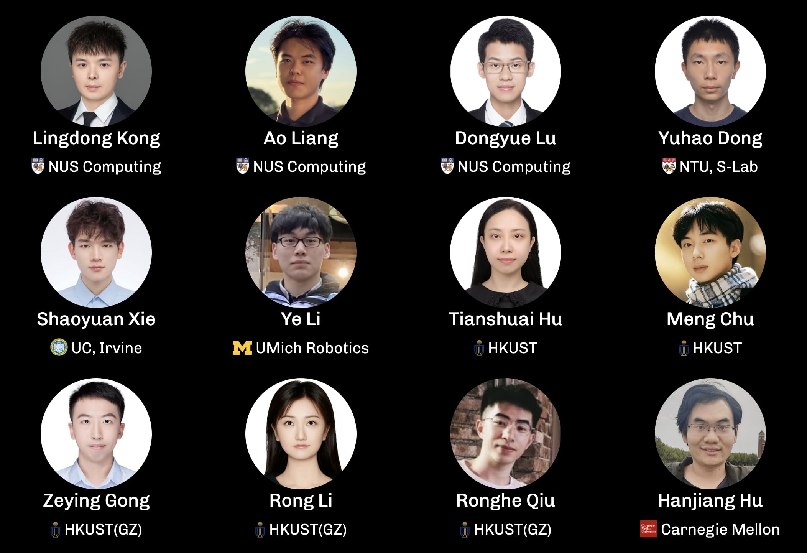

# 🤖 RoboSense Track 3: Sensor Placement

<div align="center">

**Official Baseline Implementation for Track 3**

*Based on Place3D -- "Is Your LiDAR Placement Optimized for 3D Scene Understanding?"*<br>(https://github.com/ywyeli/Place3D)

[](https://robosense2025.github.io/)
[](https://robosense2025.github.io/track3)
[](https://iros2025.org/)
[](https://www.codabench.org/competitions/9284/)
[](LICENSE)

**🏆 Prize Pool: $2,000 USD for Track 3 Winners**

<p align="center">
  
</p>

</div>


## Challenge Overview

**Track 3: Sensor Placement** challenges participants to design LiDAR-based 3D perception models, including those for 3D object detection, that can adapt to diverse sensor placements in autonomous systems.

Participants will be tasked with developing novel algorithms that can adapt to and optimize LiDAR sensor placements, ensuring high-quality 3D scene understanding across a wide range of environmental conditions, such as weather variances, motion disturbances, and sensor failures.

### 🎯 Objectives

To be added.


## Competition Details

- **Venue**: IROS 2025, Hangzhou (Oct 19-25, 2025)
- **Registration**: [Google Form](https://docs.google.com/forms/d/e/1FAIpQLSdwfvk-NHdQh9-REiBLCjHMcyLT-sPCOCzJU-ux5jbcZLTkBg/viewform) (Open until Aug 15)
- **Contact**: robosense2025@gmail.com


### 🏆 **Awards**

| Prize | Award |
|:-|:-|
| 🥇 1st Place | $1000 + Certificate |
| 🥈 2nd Place | $600 + Certificate |
| 🥉 3rd Place | $400 + Certificate |
| 🌟 Innovation Award | Cash Award + Certificate |
| Participation | Certificate |


## 📊 Official Dataset

To be added.


### Dataset Statistics

To be added.


### Baseline Performance (Phase 1)

To be added.


## 🚀 Quick Start

We provide a simple demo to run the baseline model.

### 1. **Preparing conda env**
To be added.


### 2. **Prepare the dataset**
To be added.


### 3. **Deploy**
To be added.


### 4. Evaluate the baseline
To be added.


## 🎖️ Challenge Participation

### Submission Requirements
To be added.


## 📏 Evaluation Metrics
To be added.


### Timeline
- **Registration**: [Google Form](https://docs.google.com/forms/d/e/1FAIpQLSdwfvk-NHdQh9-REiBLCjHMcyLT-sPCOCzJU-ux5jbcZLTkBg/viewform)
- **Phase 1 Deadline**: August 15th
- **Phase 2 Deadline**: September 15th
- **Awards Announcement**: IROS 2025


## 🔗 Resources

- **Challenge Website**: [robosense2025.github.io](https://robosense2025.github.io/)
- **Track Details**: [Track 3 Page](https://robosense2025.github.io/track3)
- **Track Dataset**: 
- **Baseline Model**: 
- **Related Paper**: [arXiv:2403.17009](https://arxiv.org/abs/2403.17009)


## 📧 Contact & Support

- **Email**: robosense2025@gmail.com
- **Official Website**: https://robosense2025.github.io
- **Issues**: Please use GitHub Issues for technical questions


## 📄 Citation

If you use the code and dataset in your research, please cite:

```bibtex
@inproceedings{li2024place3d,
  title = {Is Your LiDAR Placement Optimized for 3D Scene Understanding?},
  author = {Ye Li and Lingdong Kong and Hanjiang Hu and Xiaohao Xu and Xiaonan Huang},
  jbooktitle = {Advances in Neural Information Processing Systems},
  year = {2024}
}
```


## Acknowledgements

### RoboSense 2025 Challenge Organizers

<p align="center">
  
</p>


### RoboSense 2025 Program Committee

<p align="center">
  
</p>


---

<div align="center">

**🤖 Ready to sense the world robustly? Register now and compete for $2,000!**

[**📝 Register Here**](https://docs.google.com/forms/d/e/1FAIpQLSdwfvk-NHdQh9-REiBLCjHMcyLT-sPCOCzJU-ux5jbcZLTkBg/viewform) | [**🌐 Challenge Website**](https://robosense2025.github.io/) | [**📧 Contact Us**](mailto:robosense2025@gmail.com)

Made with ❤️ by the RoboSense 2025 Team

</div>
